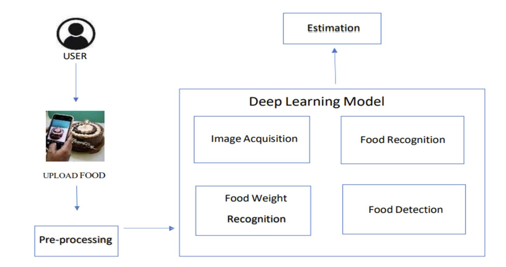

# Automated Food Identification & Calorie Estimation

This project explores how **deep learning** can be used to automatically identify food from images and estimate its calorie content. Instead of manually typing what you ate into an app, a user can upload a picture of their meal and get:

- The predicted food category (e.g., cabbage, eggplant)
- An estimated calorie value for that portion

The work was done as part of an academic mini-project.

---

## 🔍 Problem & Motivation

Calorie tracking is useful, but:

- Most apps require **manual entry** of every item.
- Users often **guess portion sizes**, which leads to inaccurate logs.
- It’s tedious enough that many people stop tracking altogether.

The idea here is to make calorie logging smoother by using **computer vision**:

> Take a photo → model recognises the food → model estimates calories.

---

## 🧠 Approach (High-Level)

The system has three main stages:

1. **Image Upload & Pre-processing**
   - User uploads a food image.
   - The image is resized and normalized.
   - Basic pre-processing (resizing, scaling, augmentation).

2. **Deep Learning Model**
   - A **Convolutional Neural Network (CNN)** is trained on labeled food images.
   - The model outputs:
     - Food **class** (e.g., cabbage, eggplant)
     - Features used for calorie estimation.

3. **Calorie Estimation**
   - For each class, a reference calorie value (per unit weight / portion) is stored.
   - The model maps the prediction + learned features to an **estimated calorie value**.

### System Architecture

> Put this image in `images/system_architecture.png` and keep the path below the same.



---

## 📂 Repository Structure

```text
.
├─ Amlproject_food_and_calorie.ipynb   # Main notebook: data prep, model, training, inference
├─ Presentation.pptx                   # Slide deck summarizing the project
├─ images/
│  ├─ output_cabbage.png              # Sample prediction – cabbage
│  ├─ output_eggplant.png             # Sample prediction – eggplant
│  └─ system_architecture.png         # Pipeline diagram
└─ README.md
